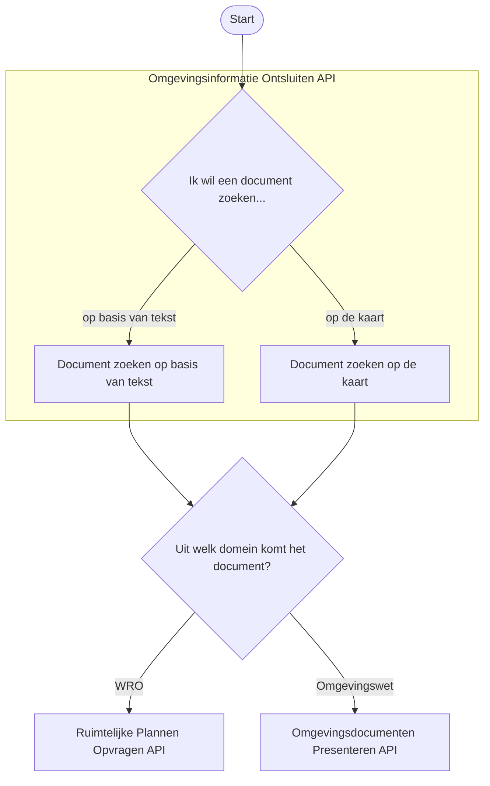
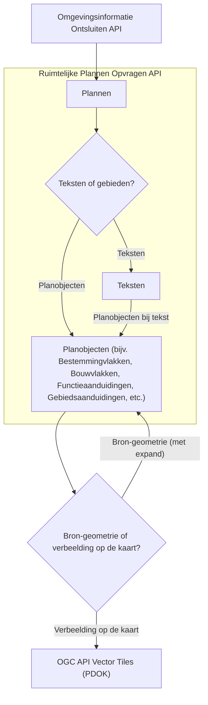
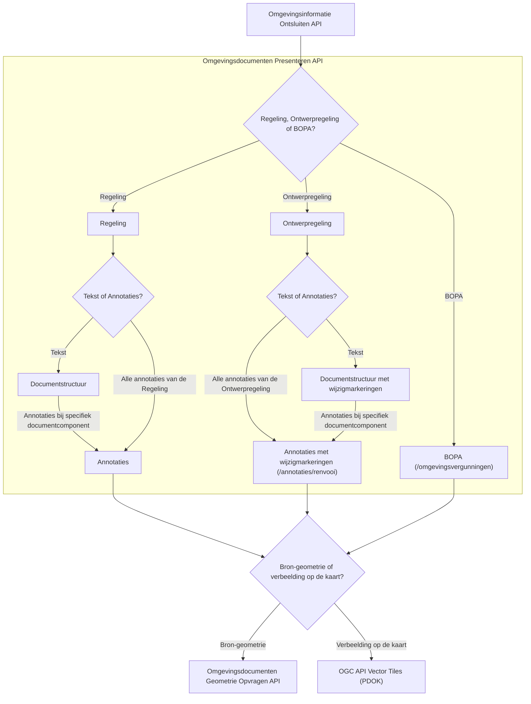

# Samenhang tussen Plan-Keten APIs


Ten bate van de bedrijfsfuncties van DSO-LV biedt de OBO Kadaster een aantal REST API's aan. Voor bepaalde use cases zijn deze API's op zichzelf bruikbaar, maar vaker nog zijn er meerdere API's nodig om tot een antwoord op je vraag te komen. Vandaar dat in dit document kort ingegaan wordt op de samenhang tussen, in het bijzonder, de volgende REST API's:
1. Omgevingsinformatie Ontsluiten API
2. Ruimtelijke Plannen Opvragen API
3. Omgevingsdocumenten Presenteren API
4. Omgevingsdocumenten Geometrie Opvragen API

# Overview

Wanneer je wilt weten welke wet- en regelgeving of beleidsinformatie er is vastgesteld op een bepaalde plek,
is het niet voldoende om alleen Omgevingsdocumenten (d.w.z. documenten op basis van de Omgevingswet) te raadplegen.
Je moet ook wet- en regelgeving op basis van de Wet ruimtelijke ordening (Wro) meenemen om een compleet beeld te hebben
van de lokale wet- en regelgeving; gemeenten hebben namelijk nog tot en met 2031 de tijd om hun wet- en regelgeving
over te brengen naar het Omgevingsplan.

Vandaar dat het DSO een API aanbiedt om tijdens deze overgangssituatie zowel documenten uit het oude domein
als documenten uit het nieuwe domein te kunnen vinden; dit is de Omgevingsinformatie Ontsluiten API. 
Wanneer je als raadpleger vervolgens details nodig hebt uit een specifiek document,
dan kun je deze opvragen in een domeinspecifieke API.

Hieronder zie je welk soort API's je allemaal tegenkomt in een typische workflow,
waarbij je begint met een algemene vraag en uitkomt bij een specifieke geometrie,
bijvoorbeeld het werkingsgebied van een regel:


Hierbij is het relevant wat je als afnemer wilt doen met de geometrie.
Wil je deze verbeelden, bijvoorbeeld om een kaartbeeld te tonen in een browser,
dan is het verstandig om de OGC API Vector Tiles te gebruiken.
Wil je zelf beschikking hebben over de bron-geometrie, bijvoorbeeld omdat je hier
databewerking op wilt doen, dan is het verstandig om geometrieën (GeoJSON)
op te halen uit de Ruimtelijke Plannen Opvragen API of de Omgevingsdocumenten Geomtrie Opvragen API,
respectievelijk voor het Wro-domein en het Omgevingswet-domein.

# Omgevingsinformatie Ontsluiten

De Omgevingsinformatie Ontsluiten API is zoals boven toegelicht de API om
over de twee verschillende domeinen heen (Wro en Omgevingswet) documenten met
wet- en regelgeving te vinden. Dit kan op basis van een geo-bevraging (GeoJSON),
via _fuzzy search_ op basis van kenmerken van het document zoals bijvoorbeeld de citeertitel,
of op basis van de identificatie van het document, zoals het plan-id (Wro) of het Work-Id (Omgevingswet).



# Ruimtelijke Plannen

In de Ruimtelijke Plannen API zijn teksten, planobjecten en geometrieën op te halen uit een Ruimtelijk Plan, bijvoorbeeld een Bestemmingsplan.



# Omgevingsdocumenten Presenteren

In de Omgevingsdocumenten Presenteren API kun je de teksten en annotaties (bijvoorbeeld Regels, Activiteiten, Gebiedsaanwijzingen) op
te halen op basis van een specifiek Omgevingsdocument, bijvoorbeeld een Regeling of Ontwerpregeling.



# Omgevingsdocumenten Geometrie Opvragen

In de Omgevingsdocumenten Geometrie Opvragen API kan vervolgens de geometrie (GeoJSON) opgehaald worden bij specifieke objecten uit de Omgevingsdocumenten Presenteren API.

# Voorbeeldflow op basis van Arazzo

Onderstaande Arazzo-specificatie TODO beschrijft een workflow, waarbij op basis van een puntlocatie een document gevonden wordt, en vervolgens een gebiedsaanwijzing (annotatie) uit dat document opgehaald wordt,
waarbij daarna de geometrie opgehaald wordt.

```yaml


arazzo: 1.0.0
info:
  title: Samenhang Plan-Keten • Amersfoort punt → Gebiedsaanwijzingen (annotaties) → Geometrie
  version: 1.0.1
  description: >
    Start met een punt (RD) in Amersfoort via Omgevingsinformatie v2.
    Haal via het Presenteren v8 annotatie-endpoint Gebiedsaanwijzingen op,
    bepaal de geometrieIdentificatie via locatierefs → locaties,
    en vraag de geometrie op via Geometrie Opvragen v1.

servers:
  - id: dso-prod
    url: https://service.omgevingswet.overheid.nl
    description: DSO-LV productie

actors:
  - id: omgevingsinformatie
    type: api
    name: Omgevingsinformatie Ontsluiten v2
    baseUrl: /publiek/omgevingsinformatie/api/ontsluiten/v2         # v2 basis-URL [4](https://iplo.nl/digitaal-stelsel/aansluiten/open-data-api/)
    security:
      - type: apiKey
        in: header
        name: x-api-key

  - id: presenteren
    type: api
    name: Omgevingsdocumenten Presenteren v8
    baseUrl: /publiek/omgevingsdocumenten/api/presenteren/v8         # v8 basis-URL [5](https://developer.omgevingswet.overheid.nl/api-register/api/omgevingsdocument-presenteren/)
    security:
      - type: apiKey
        in: header
        name: x-api-key

  - id: geometrie
    type: api
    name: Omgevingsdocumenten Geometrie Opvragen v1
    baseUrl: /publiek/omgevingsdocumenten/api/geometrieopvragen/v1   # v1 basis-URL [3](https://dso-devs.github.io/docs/plan-keten/omgevingsdocumenten-geometrie-opvragen-api)
    security:
      - type: apiKey
        in: header
        name: x-api-key

workflow:
  - id: stap1-punt-amersfoort
    name: Zoek documenten op puntlocatie (RD) in Amersfoort
    actor: omgevingsinformatie
    request:
      method: POST
      endpoint: /documenten/_zoek                                  # geo-zoek Omgevingsinformatie v2 [6](https://iplo.nl/digitaal-stelsel/toepasbare-regels/starten/omgevingsdocumenten-annoteren-toepasbare-regels/)
      headers:
        Content-Type: application/json
        Content-Crs: http://www.opengis.net/def/crs/EPSG/0/28992   # RD (Content-Crs vereist bij geo-body) [6](https://iplo.nl/digitaal-stelsel/toepasbare-regels/starten/omgevingsdocumenten-annoteren-toepasbare-regels/)
      query:
        page: 1
        size: 20
        _sort: sortDatum,desc
      body:
        geometrie:
          type: Point
          coordinates: [155000, 463000]                           # RD-voorbeeldcoördinaat (Amersfoort) [6](https://iplo.nl/digitaal-stelsel/toepasbare-regels/starten/omgevingsdocumenten-annoteren-toepasbare-regels/)
    response:
      save:
        - key: zoekResultaat
          path: $

  - id: stap2-annotaties-gebiedsaanwijzingen
    name: Haal Gebiedsaanwijzing(en) op via Presenteren v8 annotatie-endpoint
    actor: presenteren
    request:
      method: POST
      endpoint: {ANNOTATIE_ENDPOINT}                               # vul hier het annotatiepad uit v8 OpenAPI in (regeltekst/divisie) [7](https://developer.omgevingswet.overheid.nl/publish/pages/204330/ozon-api-downloadservice-v1_1.pdf)[2](https://developer.omgevingswet.overheid.nl/publish/pages/166112/omgevingsdocumenten-presenteren-v8.json)
      headers:
        Content-Type: application/json
        Content-Crs: http://www.opengis.net/def/crs/EPSG/0/28992   # CRS84 (default) niet ondersteund; geef RD expliciet mee [2](https://developer.omgevingswet.overheid.nl/publish/pages/166112/omgevingsdocumenten-presenteren-v8.json)
      body:
        geometrie:
          type: Point
          coordinates: [155000, 463000]
        # optioneel: geldigOp, inWerkingOp, beschikbaarOp, synchroniseerMetTileset
    response:
      save:
        # 2a) Kies een Gebiedsaanwijzing uit de annotatie-respons (self-contained) [1](https://developer.omgevingswet.overheid.nl/publish/pages/166112/migratiehandleiding.pdf)
        - key: eersteGebiedsaanwijzing
          path: $.annotaties.gebiedsaanwijzingen[0]                # sleutelnaam is afhankelijk van endpoint; pas aan aan jouw payload
        # 2b) Pak de eerste locatieIdentificatie via locatierefs (zoals je aangaf)
        - key: locatieIdentificatie
          path: $.annotaties.gebiedsaanwijzingen[0].locatierefs[0].locatieIdentificatie
        # 2c) Vind in dezelfde respons het locatie-object met identiek 'identificatie'
        #     en lees daaruit de geometrieIdentificatie (self-contained graph in v8) [1](https://developer.omgevingswet.overheid.nl/publish/pages/166112/migratiehandleiding.pdf)
        - key: geometrieIdentificatie
          path: $.annotaties.locaties[?(@.identificatie == ${{ locatieIdentificatie }})].geometrieIdentificatie

  - id: stap3-geometrie-ophalen
    name: Haal GeoJSON geometrie op (Geometrie Opvragen v1)
    actor: geometrie
    request:
      method: GET
      endpoint: /geometrieen/${{ geometrieIdentificatie }}        # levert GeoJSON met type + coördinaatlijst [3](https://dso-devs.github.io/docs/plan-keten/omgevingsdocumenten-geometrie-opvragen-api)
      headers: {}
      query:
        crs: http://www.opengis.net/def/crs/EPSG/0/28992           # verplicht; zonder crs → 422 [3](https://dso-devs.github.io/docs/plan-keten/omgevingsdocumenten-geometrie-opvragen-api)
    response:
      save:
        - key: geojson
          path: $
      output:
        - name: resultaat
          value:
            gebiedsaanwijzing: ${{ eersteGebiedsaanwijzing }}
            locatieIdentificatie: ${{ locatieIdentificatie }}
            geometrie: ${{ geojson }}

```
