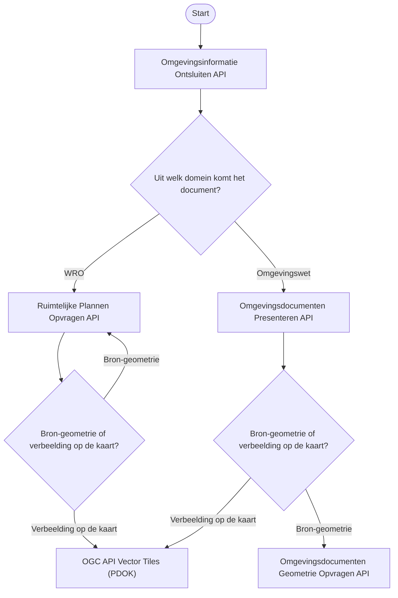
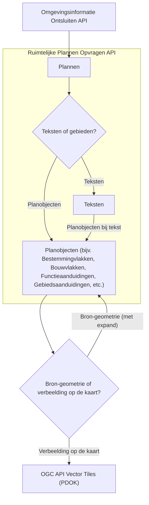
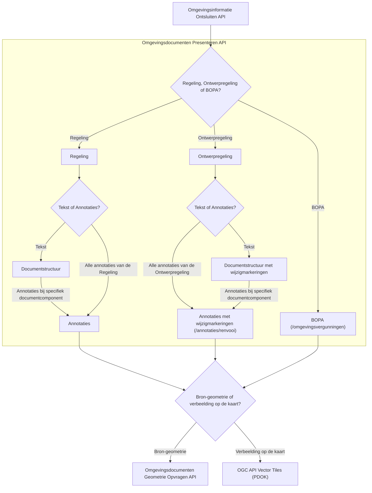

# Samenhang tussen Plan-Keten APIs


Ten bate van de bedrijfsfuncties van DSO-LV biedt de OBO Kadaster een aantal REST API's aan. Voor bepaalde use cases zijn deze API's op zichzelf bruikbaar, maar vaker nog zijn er meerdere API's nodig om tot een antwoord op je vraag te komen. Vandaar dat in dit document kort ingegaan wordt op de samenhang tussen, in het bijzonder, de volgende REST API's:
1. Omgevingsinformatie Ontsluiten API
2. Ruimtelijke Plannen Opvragen API
3. Omgevingsdocumenten Presenteren API
4. Omgevingsdocumenten Geometrie Opvragen API

# Overview

Wanneer je wilt weten welke wet- en regelgeving of beleidsinformatie er is vastgesteld op een bepaalde plek,
is het niet voldoende om alleen Omgevingsdocumenten (d.w.z. documenten op basis van de Omgevingswet) te raadplegen.
Je moet ook wet- en regelgeving op basis van de Wet ruimtelijke ordening (Wro) meenemen om een compleet beeld te hebben
van de lokale wet- en regelgeving; gemeenten hebben namelijk nog tot en met 2031 de tijd om hun wet- en regelgeving
over te brengen naar het Omgevingsplan.

Vandaar dat het DSO een API aanbiedt om tijdens deze overgangssituatie zowel documenten uit het oude domein
als documenten uit het nieuwe domein te kunnen vinden; dit is de Omgevingsinformatie Ontsluiten API. 
Wanneer je als raadpleger vervolgens details nodig hebt uit een specifiek document,
dan kun je deze opvragen in een domeinspecifieke API.

Hieronder zie je welk soort API's je allemaal tegenkomt in een typische workflow,
waarbij je begint met een algemene vraag en uitkomt bij een specifieke geometrie,
bijvoorbeeld het werkingsgebied van een regel:



Hierbij is het relevant wat je als afnemer wilt doen met de geometrie.
Wil je deze verbeelden, bijvoorbeeld om een kaartbeeld te tonen in een browser,
dan is het verstandig om de OGC API Vector Tiles te gebruiken.
Wil je zelf beschikking hebben over de bron-geometrie, bijvoorbeeld omdat je hier
databewerking op wilt doen, dan is het verstandig om geometrieën (GeoJSON)
op te halen uit de Ruimtelijke Plannen Opvragen API of de Omgevingsdocumenten Geomtrie Opvragen API,
respectievelijk voor het Wro-domein en het Omgevingswet-domein.

# Omgevingsinformatie Ontsluiten

De Omgevingsinformatie Ontsluiten API is zoals boven toegelicht de API om
over de twee verschillende domeinen heen (Wro en Omgevingswet) documenten met
wet- en regelgeving te vinden. Dit kan op basis van een geo-bevraging (GeoJSON),
via _fuzzy search_ op basis van kenmerken van het document zoals bijvoorbeeld de citeertitel,
of op basis van de identificatie van het document, zoals het plan-id (Wro) of het Work-Id (Omgevingswet).


# Ruimtelijke Plannen

In de Ruimtelijke Plannen API zijn teksten, planobjecten en geometrieën op te halen uit een Ruimtelijk Plan, bijvoorbeeld een Bestemmingsplan.



# Omgevingsdocumenten Presenteren

In de Omgevingsdocumenten Presenteren API kun je de teksten en annotaties (bijvoorbeeld Regels, Activiteiten, Gebiedsaanwijzingen) op
te halen op basis van een specifiek Omgevingsdocument, bijvoorbeeld een Regeling of Ontwerpregeling.



# Omgevingsdocumenten Geometrie Opvragen

In de Omgevingsdocumenten Geometrie Opvragen API kan vervolgens de geometrie (GeoJSON) opgehaald worden bij specifieke objecten uit de Omgevingsdocumenten Presenteren API.

# Voorbeeldflow op basis van Arazzo

Onderstaande [Arazzo-specificatie](https://www.openapis.org/arazzo-specification) beschrijft een workflow, waarbij op basis van een puntlocatie een document gevonden wordt, en vervolgens een gebiedsaanwijzing (annotatie) uit dat document opgehaald wordt,
waarbij daarna de geometrie opgehaald wordt.

```yaml
arazzo: 1.0.1
info:
  title: Amersfoort • Punt → Gebiedsaanwijzing (regeltekstannotaties) → Geometrie
  version: 1.0.0
  summary: >
    Punt (RD) → Presenteren v8 regeltekstannotaties → Geometrie v1.

sourceDescriptions:
  - name: omgevingsinformatie-v2
    type: openapi
    url: https://service.omgevingswet.overheid.nl/publiek/omgevingsinformatie/api/ontsluiten/v2/openapi.json
  - name: presenteren-v8
    type: openapi
    url: https://service.omgevingswet.overheid.nl/publiek/omgevingsdocumenten/api/presenteren/v8/openapi.json
  - name: geometrie-opvragen-v1
    type: openapi
    url: https://service.omgevingswet.overheid.nl/publiek/omgevingsdocumenten/api/geometrieopvragen/v1/openapi.json

workflows:
  - workflowId: amersfoort-punt-naar-geometrie
    summary: Punt → regeltekstannotaties → geometrie (met gescheiden API keys)
    description: |
      Stap 1: Omgevingsinformatie v2 (POST /documenten/_zoek) — Content-Crs verplicht (RD).
      Stap 2: Presenteren v8 regeltekstannotaties — self-contained, haal via locatierefs de geometrieIdentificatie.
      Stap 3: Geometrie Opvragen v1 (GET /geometrieen/{…}?crs=…) — crs-query verplicht (RD/EPSG:28992).

    inputs:
      type: object
      properties:
        apiKeyOmgevingsinformatie:
          type: string
          description: API key voor Omgevingsinformatie Ontsluiten v2
        apiKeyPresenteren:
          type: string
          description: API key voor Omgevingsdocumenten Presenteren v8
        apiKeyGeometrie:
          type: string
          description: API key voor Geometrie Opvragen v1

    steps:
      - stepId: zoek-documenten-op-punt
        description: Zoek relevante documenten op RD-punt in Amersfoort
        operationPath: "${$sourceDescriptions.omgevingsinformatie-v2.url}#/paths/~1documenten~1_zoek/post"
        parameters:
          - name: x-api-key
            in: header
            value: "{$inputs.apiKeyOmgevingsinformatie}"
          - name: Content-Crs
            in: header
            value: "http://www.opengis.net/def/crs/EPSG/0/28992"
          - name: page
            in: query
            value: "1"
          - name: size
            in: query
            value: "20"
          - name: _sort
            in: query
            value: "sortDatum,desc"
        requestBody:
          contentType: application/json
          payload:
            geometrie:
              type: Point
              coordinates: [155000, 463000]
        successCriteria:
          - condition: $statusCode == 200
        outputs:
          zoekResultaat: $response.body#/

      - stepId: haal-annotaties-gebiedsaanwijzing
        description: >
          Haal Gebiedsaanwijzing(en) via Presenteren v8 regeltekstannotaties.
          Bepaal locatieIdentificatie via locatierefs en vind geometrieIdentificatie in annotaties.locaties.
        operationPath: "${$sourceDescriptions.presenteren-v8.url}#/paths/~1annotaties~1regeltekstannotaties~1_zoek/post"
        parameters:
          - name: x-api-key
            in: header
            value: "{$inputs.apiKeyPresenteren}"
          - name: Content-Crs
            in: header
            value: "http://www.opengis.net/def/crs/EPSG/0/28992"
        requestBody:
          contentType: application/json
          payload:
            geometrie:
              type: Point
              coordinates: [155000, 463000]
        successCriteria:
          - condition: $statusCode == 200
        outputs:
          eersteGebiedsaanwijzing: $response.body#/annotaties/gebiedsaanwijzingen/0
          locatieIdentificatie: $response.body#/annotaties/gebiedsaanwijzingen/0/locatierefs/0/locatieIdentificatie
          geometrieIdentificatie: $response.body#/annotaties/locaties/0/geometrieIdentificatie
      - stepId: haal-geojson
        description: Haal GeoJSON voor geometrieIdentificatie (Geometrie Opvragen v1)
        operationPath: "${$sourceDescriptions.geometrie-opvragen-v1.url}#/paths/~1geometrieen~1{geometrieIdentificatie}~1/get"
        parameters:
          - name: x-api-key
            in: header
            value: "{$inputs.apiKeyGeometrie}"
          - name: geometrieIdentificatie
            in: path
            value: "{$steps.haal-annotaties-gebiedsaanwijzing.outputs.geometrieIdentificatie}"
          - name: crs
            in: query
            value: "http://www.opengis.net/def/crs/EPSG/0/28992"
        successCriteria:
          - condition: $statusCode == 200
        outputs:
          geojson: $response.body#/
```
