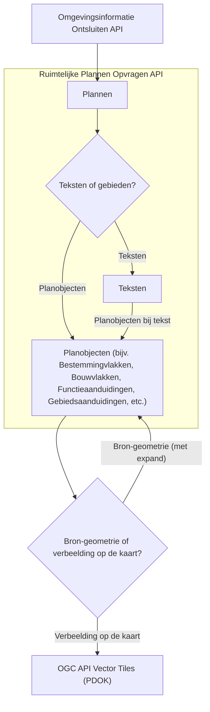
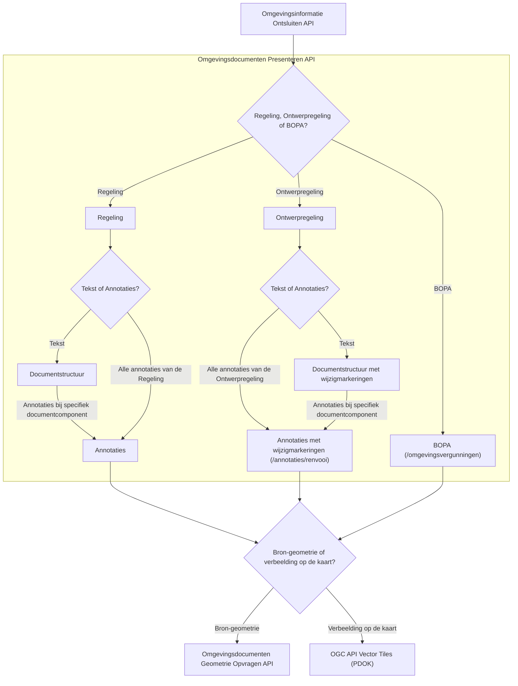

# Samenhang tussen Plan-Keten APIs

Ten bate van de bedrijfsfuncties van DSO-LV biedt de OBO Kadaster een aantal REST API's aan. Voor bepaalde use cases zijn deze API's op zichzelf bruikbaar, maar vaker nog zijn er meerdere API's nodig om tot een antwoord op je vraag te komen. Vandaar dat in dit document kort ingegaan wordt op de samenhang tussen, in het bijzonder, de volgende REST API's:
1. Omgevingsinformatie Ontsluiten API
2. Ruimtelijke Plannen Opvragen API
3. Omgevingsdocumenten Presenteren API
4. Omgevingsdocumenten Geometrie Opvragen API

# Overview

-----Toelichtings-tekst - Nader in te vullen-----

# Omgevingsinformatie Ontsluiten

-----Toelichtings-tekst - Nader in te vullen-----

# Ruimtelijke Plannen

-----Toelichtings-tekst - Nader in te vullen-----

# Omgevingsdocumenten Presenteren

-----Toelichtings-tekst - Nader in te vullen-----

